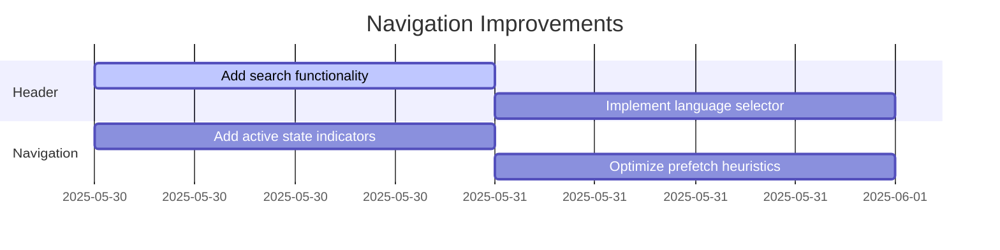

# Active Context

## Current Work Focus
- Implementing navigation improvements
- Optimizing mobile menu UX
- Adding service priority indicators

## Recent Changes
1. Added priority-based prefetching to navigation links
2. Implemented mobile menu with service icons
3. Organized services into categories with visual indicators
4. Added contact CTA buttons in header

## Key Decisions & Considerations
- Using priority-based prefetching (`high`, `medium`, `low`) to optimize performance
- Mobile menu shows full service details with icons
- Using Shadcn UI components for consistent design
- Separate navigation structure for desktop/mobile

## Next Steps


## Relevant Code Snippets
```tsx
// Priority-based prefetch function
const shouldPrefetch = (priority?: 'high' | 'medium' | 'low') => {
  switch (priority) {
    case 'high': return true
    case 'medium': return true
    case 'low': return false
    default: return true
  }
}
```

```tsx
// Service navigation structure
const services: NavSection = {
  title: "Services",
  items: [
    {
      title: "Website Development",
      href: "/services/website-development",
      description: "Custom websites that establish credibility...",
      icon: Globe,
      priority: 'high'
    },
    // ... other services
  ]
}
