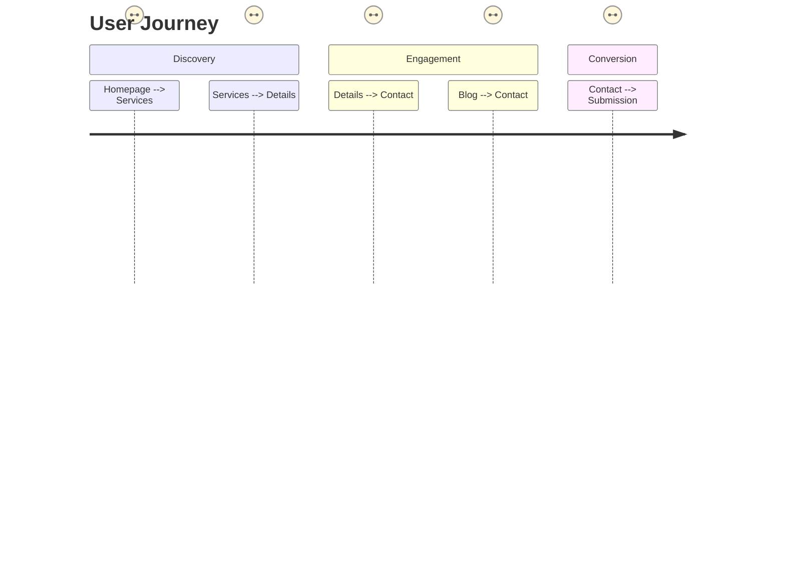

# Product Context

## Business Purpose
- Digital marketing platform for trucking industry clients
- Showcase services and capabilities to potential customers
- Generate leads through contact forms and CTAs
- Establish brand authority through content marketing

## Core Problems Solved
1. Centralized information hub for trucking services
2. Streamlined customer inquiry process
3. Showcase of industry expertise and case studies
4. Improved online visibility for trucking businesses

## User Experience Goals

## Key User Flows
1. Service discovery → Service details → Contact
2. Blog content → Service association → Contact
3. Case studies → Trust building → Contact

## Content Strategy
- Service-focused content with technical specifications
- Educational blog content on trucking industry topics
- Customer success stories demonstrating results
- Visual gallery showcasing fleet and operations
