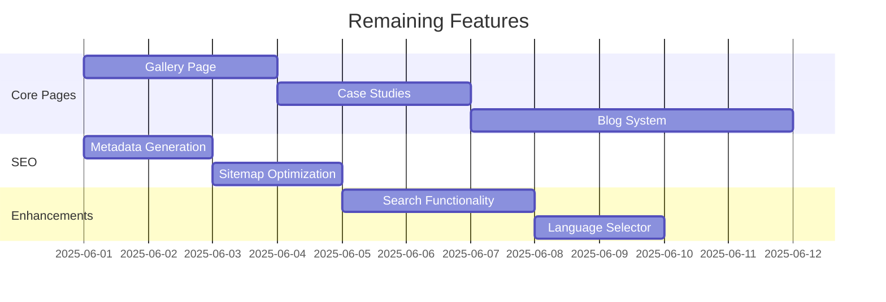

# Progress

## What Works
- Header navigation with desktop and mobile views
- Service navigation with priority-based prefetching
- Contact form submission functionality
- Service detail pages with dynamic routing
- Hero section with CTA
- Logo grid section

## What's Left to Build

## Current Status
- Development in progress
- Core navigation and layout complete
- Service pages 80% implemented
- Contact functionality working

## Known Issues
1. Mobile menu animation could be smoother
2. Prefetch heuristics need refinement
3. Some service icons don't match content
