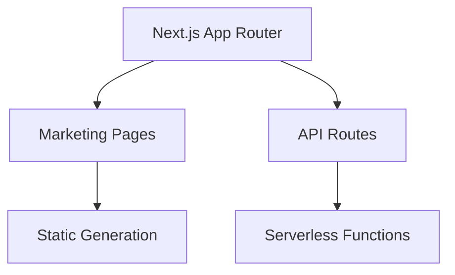
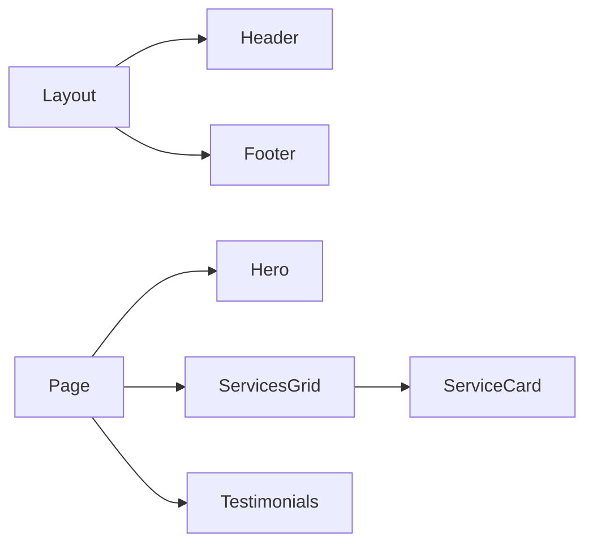

# System Patterns

## Architecture

## Component Relationships

## Key Technical Decisions
1. **App Router Structure**: Organized by marketing sections with route groups
2. **Component Architecture**: 
   - Layout components for consistent structure
   - Section components for page composition
   - UI components from Shadcn library
3. **Data Management**: 
   - Local data files in `src/data/`
   - Content collections for MDX blog posts
4. **Styling Approach**: 
   - Tailwind CSS with utility-first classes
   - Custom design system in `src/components/ui/design-system.tsx`

## Design Patterns in Use
- Component composition for flexible sections
- Server Components for data fetching
- Client Components for interactivity
- Dynamic routes for service detail pages
- API route handlers for form submissions
